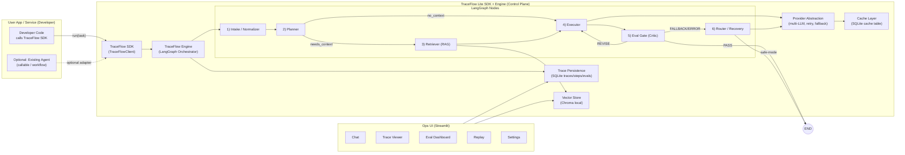

# TraceFlow Lite — Box Diagram Architecture

```mermaid
flowchart LR
  subgraph APP["User App / Service (Developer)"]
    U["Developer Code<br/>calls TraceFlow SDK"]
    BYO["Optional: Existing Agent<br/>(callable / workflow)"]
  end

  subgraph TF["TraceFlow Lite SDK + Engine (Control Plane)"]
    SDK["TraceFlow SDK<br/>(TraceFlowClient)"]
    ENG["TraceFlow Engine<br/>(LangGraph Orchestrator)"]

    subgraph NODES["LangGraph Nodes"]
      N1["1) Intake / Normalizer"]
      N2["2) Planner"]
      N3["3) Retriever (RAG)"]
      N4["4) Executor"]
      N5["5) Eval Gate (Critic)"]
      N6["6) Router / Recovery"]
    end

    PROV["Provider Abstraction<br/>(multi-LLM, retry, fallback)"]
    CACHE["Cache Layer<br/>(SQLite cache table)"]
    STORE["Trace Persistence<br/>(SQLite traces/steps/evals)"]
    KB["Vector Store<br/>(Chroma local)"]
  end

  subgraph UI["Ops UI (Streamlit)"]
    CHAT["Chat"]
    TV["Trace Viewer"]
    ED["Eval Dashboard"]
    RP["Replay"]
    SET["Settings"]
  end

  %% Developer usage
  U -->|"run(task)"| SDK --> ENG
  BYO -. optional adapter .-> SDK

  %% Engine orchestration
  ENG --> N1 --> N2
  N2 -->|needs_context| N3 --> KB
  N2 -->|no_context| N4
  N3 --> N4

  %% Execution + gating + recovery
  N4 --> PROV --> CACHE
  N4 --> N5
  N5 -->|PASS| ENDNODE((END))
  N5 -->|REVISE| N4
  N5 -->|"FALLBACK/ERROR"| N6 --> PROV
  N6 -->|safe-mode| ENDNODE

  %% Persistence + UI reads
  ENG --> STORE
  UI --> STORE
  UI --> KB
```
