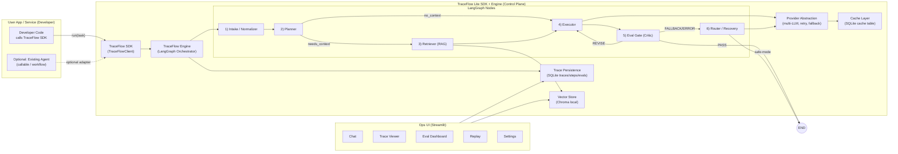

%% TraceFlow Lite — Architecture (Control Plane + SDK)
%% Save as: docs/architecture.mmd  (or .md with ```mermaid blocks)
%% Mermaid supports multiple diagrams per file; keep each diagram separated.



  %% =========================
  %% 2) SEQUENCE DIAGRAM: "SDK RUN" FLOW
  %% =========================

```mermaid
sequenceDiagram
  autonumber
  actor Dev as Developer
  participant SDK as TraceFlowClient (SDK)
  participant Eng as TraceFlow Engine (LangGraph)
  participant TS as TraceStore (SQLite)
  participant VS as VectorStore (Chroma)
  participant LLM as Provider Router (LLM Abstraction)
  participant EG as Eval Gate
  participant UI as Streamlit UI

  Dev->>SDK: run(user_input, mode, settings[, agent_adapter])
  SDK->>TS: create_trace(trace_id, mode, inputs, settings)

  SDK->>Eng: invoke(graph, initial_state)
  Eng->>Eng: Intake/Normalize
  Eng->>Eng: Planner

  alt needs_context = true
    Eng->>VS: retrieve(query, top_k)
    VS-->>Eng: chunks + metadata (C1..Ck)
  else needs_context = false
    Eng->>Eng: skip retrieval
  end

  Eng->>LLM: generate(draft) via provider abstraction
  LLM-->>Eng: draft + tokens/cost/latency

  Eng->>EG: eval_gate(draft, mode, strictness)
  EG-->>Eng: decision PASS/REVISE/FALLBACK + reasons

  alt decision = REVISE and loops_remaining
    Eng->>LLM: regenerate(with revision instructions)
    LLM-->>Eng: revised draft
    Eng->>EG: eval_gate(revised)
    EG-->>Eng: PASS/REVISE/FALLBACK
  end

  alt decision = FALLBACK or exception
    Eng->>LLM: retry/backoff or switch provider/model
    LLM-->>Eng: fallback draft OR error
  end

  Eng->>TS: append_step traces/steps/evals (timeline)
  Eng->>TS: finalize_trace(status, totals, final_answer)

  SDK-->>Dev: result(final_answer, trace_id, eval_report, telemetry)

  Dev->>UI: open Trace Viewer / Replay
  UI->>TS: load(trace_id)
  TS-->>UI: steps + evals + telemetry
  UI-->>Dev: timeline + replay controls
