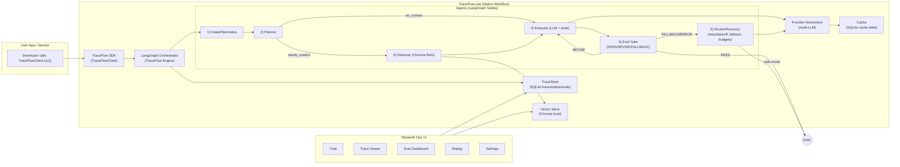

# TraceFlow Lite — Native Workflow

```mermaid
flowchart LR
  subgraph APP["User App / Service"]
    U["Developer calls TraceFlowClient.run()"]
  end

  subgraph TF["TraceFlow Lite (Native Workflow)"]
    SDK["TraceFlow SDK<br/>(TraceFlowClient)"]
    ENG["LangGraph Orchestrator<br/>(TraceFlow Engine)"]

    subgraph NODES["Agents (LangGraph Nodes)"]
      N1["1) Intake/Normalize"]
      N2["2) Planner"]
      N3["3) Retriever (Chroma RAG)"]
      N4["4) Executor (LLM + tools)"]
      N5["5) Eval Gate<br/>(PASS/REVISE/FALLBACK)"]
      N6["6) Router/Recovery<br/>(retry/backoff, fallback, budgets)"]
    end

    PROV["Provider Abstraction<br/>(multi-LLM)"]
    CACHE["Cache<br/>(SQLite cache table)"]
    STORE["TraceStore<br/>(SQLite traces/steps/evals)"]
    KB["Vector Store<br/>(Chroma local)"]
  end

  subgraph UI["Streamlit Ops UI"]
    CHAT["Chat"]
    TV["Trace Viewer"]
    ED["Eval Dashboard"]
    RP["Replay"]
    SET["Settings"]
  end

  U --> SDK --> ENG
  ENG --> N1 --> N2
  N2 -->|needs_context| N3 --> KB
  N2 -->|no_context| N4
  N3 --> N4 --> PROV --> CACHE
  N4 --> N5
  N5 -->|PASS| ENDNODE((END))
  N5 -->|REVISE| N4
  N5 -->|"FALLBACK/ERROR"| N6 --> PROV
  N6 -->|safe-mode| ENDNODE
  ENG --> STORE
  UI --> STORE
  UI --> KB
```